# HomoGAN
Training a GAN from scratch and improve it by experiments 

## Table of Contents

- [HomoGAN](#homogan)
  * [Table of Contents](#table-of-contents)
  * [Installation](#installation)
  * [Running experiments](#running-experiments)
  * [Dataset](#dataset)
  * [Glossary](#glossary)
  * [Experiments](#experiments)
    + [Experiment 1](#experiment-1)
    + [Experiment 2](#experiment-2)
    + [Experiment 3](#experiment-3)
    + [Experiment 4](#experiment-4)
      - [Results](#results)
    + [Experiment 5](#experiment-5)
      - [Results](#results-1)
    + [Experiment 6](#experiment-6)
    + [Experiment 7](#experiment-7)
    + [Experiment 8](#experiment-8)
    + [Experiment 9](#experiment-9)
    + [Experiment 10](#experiment-10)
    + [Experiment 11](#experiment-11)
    + [Experiment 12](#experiment-12)

## Installation
    $ git clone https://github.com/anieto95/homogan
    $ cd homogan/
    $ sudo pip3 install -r requirements.txt	- TODO

## Running experiments

Simply run the `main.py`

## Dataset

CelebFaces Attributes Dataset (CelebA) is a large-scale face attributes dataset with more than 200K celebrity images, each with 40 attribute annotations. The images in this dataset cover large pose variations and background clutter.

## Glossary
* Generator (G)
* Discriminator (D)
* Fully Connected (FC)
* Fully Convolutional (FConv)

## Experiments
### Experiment 1
- Added normalization

### Experiment 2
- Normalization

### Experiment 3
- Normalization

### Experiment 4
Change from previous models: 
* The two FC input layers of the G changed to FConv.
* Update restriction on the D -> D is not updated while G loss is >4.

#### Results
Trainning size = 10.000\
Trainning Epochs = 20\
Batch Size = 16

__Observation__: 
|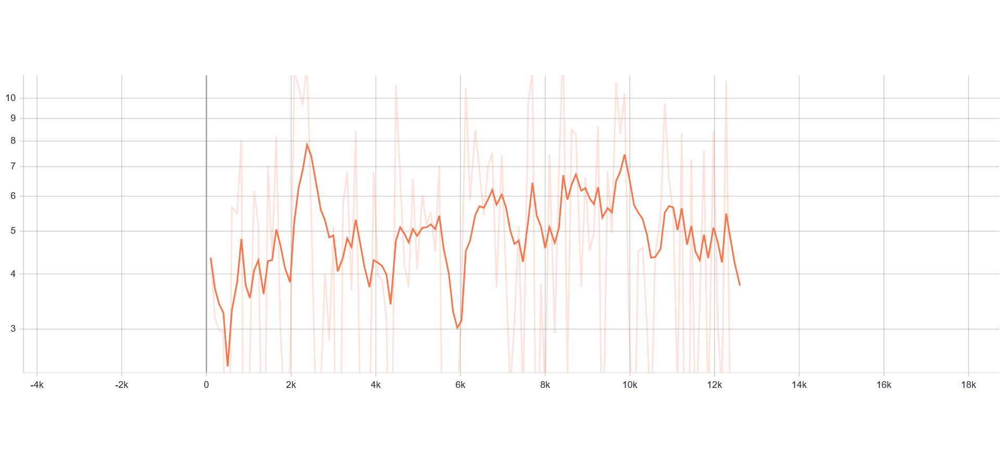||
|:---:|:---:|
|Generator Loss|Discriminator Loss|
* Fake accuracy grows rapidly at the first epochs, reaching the value 0.95, but then decreases with each epoch and tends to stabilize around 0.7
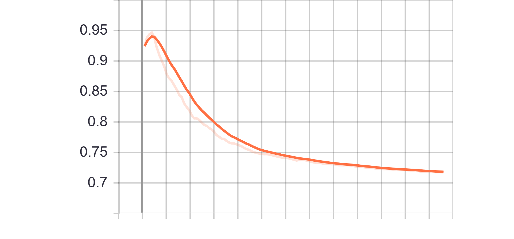
* Real accuracy increases at the beginning, reaching the value 0.8, but then decreases with each epoch and tends to stabilize around 0.45

### Experiment 5
Change from previous models: 
* Removed restriction on D update

#### Results
Trainning size = 10.000\
Trainning Epochs = 20\
Batch Size = 16

__Observation__: 
||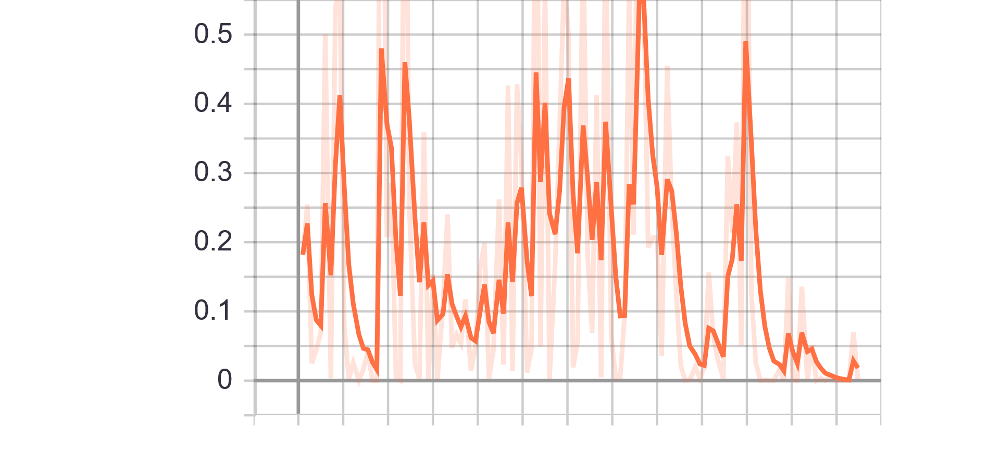|
|:---:|:---:|
|Generator Loss|Discriminator Loss|
* Fake accuracy 
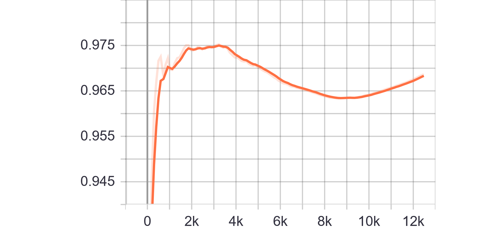
* Real accuracy 

### Experiment 6
Change from previous models: 
* Added label smoothing (0 -> {0-0.1} and 1 -> {0.9-1})
* Added label flipping on 5% of labels

#### Results
Trainning size = 10.000\
Trainning Epochs = 20\
Batch Size = 16

__Observation__: 
|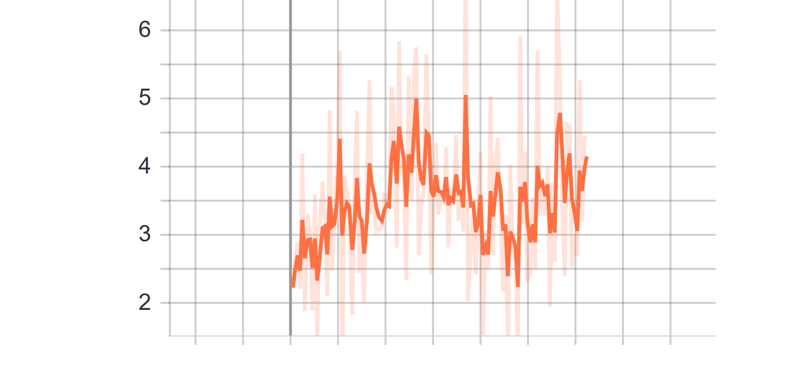|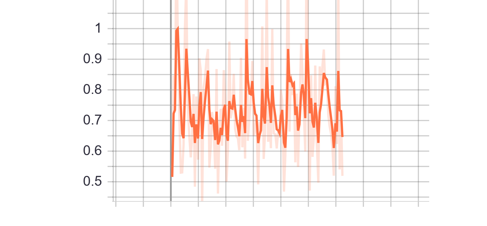|
|:---:|:---:|
|Generator Loss|Discriminator Loss|
* Fake accuracy 
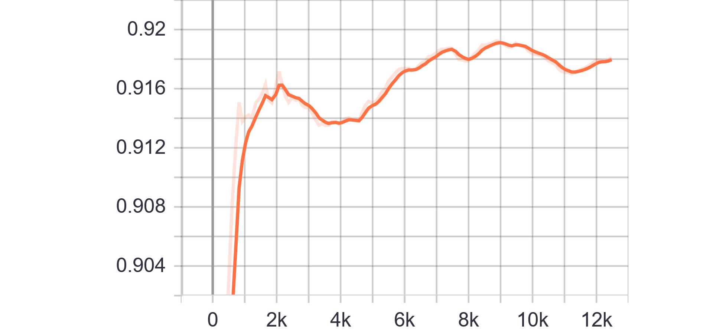
* Real accuracy 
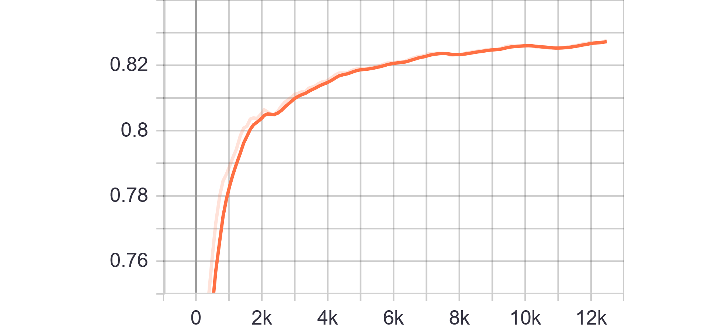

### Experiment 7
Change from previous models: 
* Change model architecture.
* Remove BatchNorm layers
* Remove Label Smoothing and Label flip

#### Results
Trainning size = 10.000\
Trainning Epochs = 100\
Batch Size = 100

__Observation__: 
|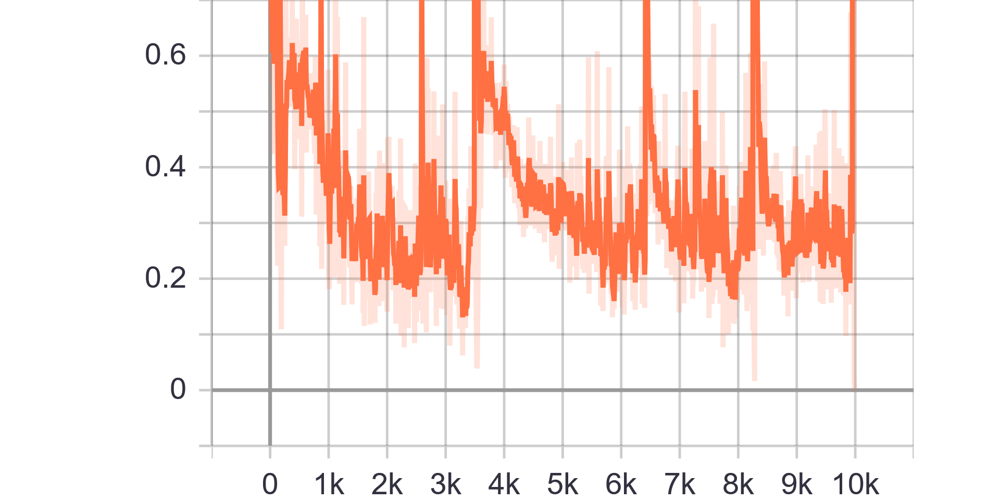|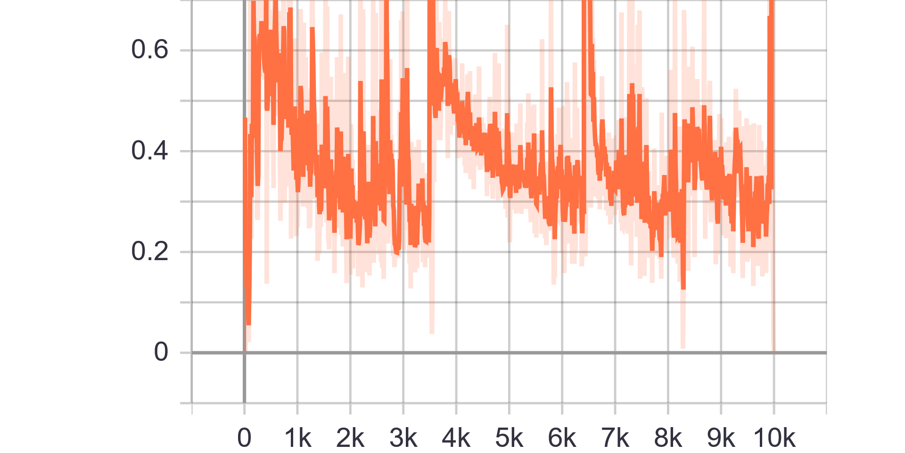|
|:---:|:---:|
|Discriminator Loss Fake|Discriminator Loss Real|
|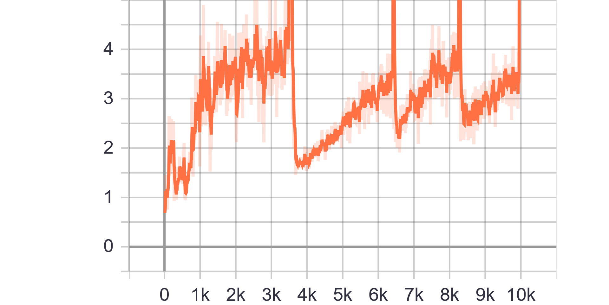|
|Generator Loss|

### Experiment 8
Change from previous models: 
* Only male images
* Added label smoothing (0 -> {0-0.1} and 1 -> {0.9-1})
* Added label flipping on 5% of labels

#### Results
Trainning size = 22.000\
Trainning Epochs = 100\
Batch Size = 200

__Observation__: 
|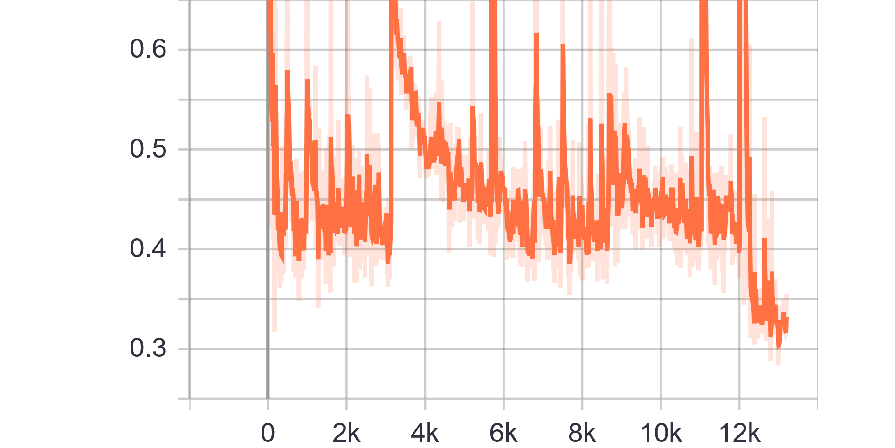|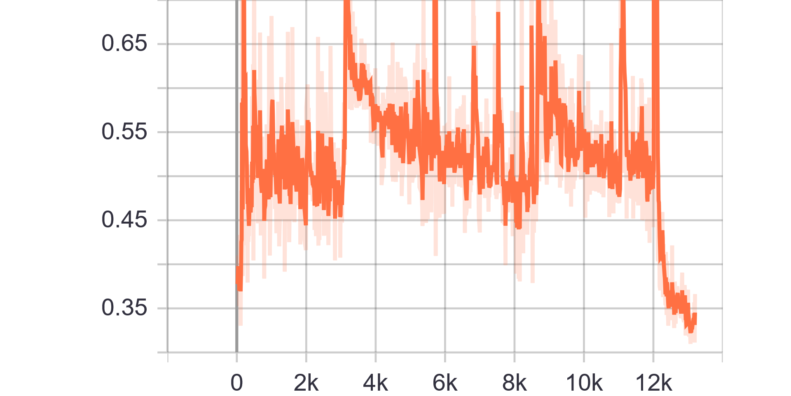|
|:---:|:---:|
|Discriminator Loss Fake|Discriminator Loss Real|
|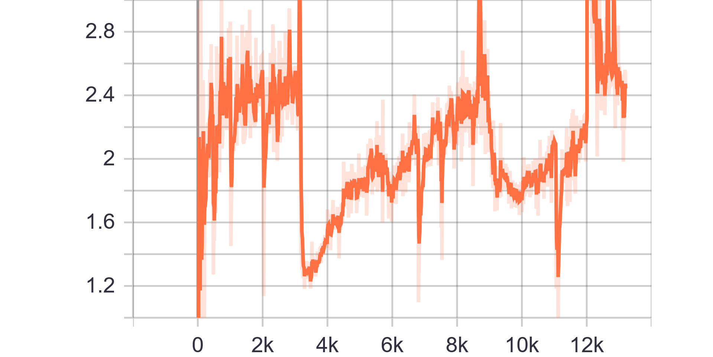|
|Generator Loss|

### Experiment 9
Change from previous models: 
* Using male and female images at 50%
* Introduced training ratio G:D, set to 1:3 (traing D 3 times more than G)

#### Results
Trainning size = 10.000\
Trainning Epochs = 100\
Batch Size = 100

__Observation__: 
||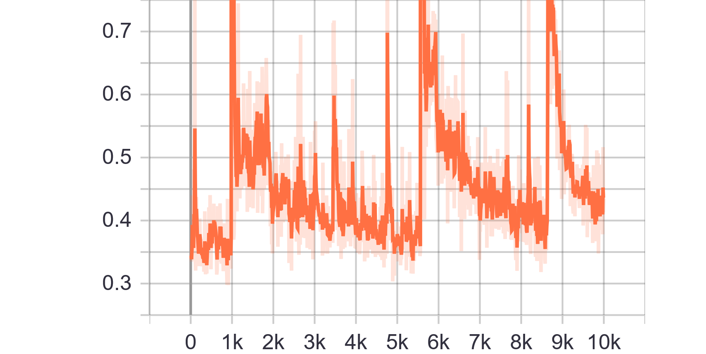|
|:---:|:---:|
|Discriminator Loss Fake|Discriminator Loss Real|
||
|Generator Loss|

### Experiment 10
Change from previous models: 
* Chenge architecture to introduce conditioning GAN
* Only 1 feature allowed for conditioning 
* Ratio G:D, set to 1:1

#### Results
Trainning size = 10.000\
Trainning Epochs = 100\
Batch Size = 100

__Observation__: 
|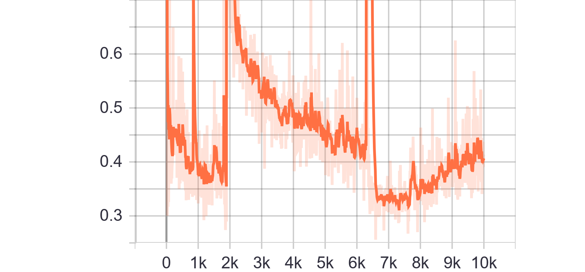||
|:---:|:---:|
|Discriminator Loss Fake|Discriminator Loss Real|
|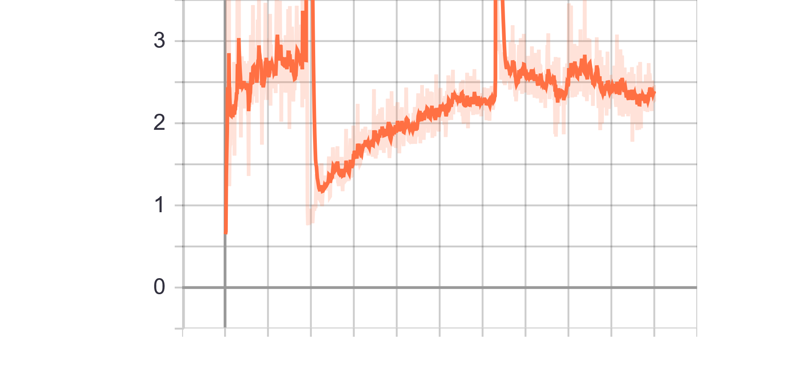|
|Generator Loss|

### Experiment 11
- Normalization

### Experiment 12
- Normalization
