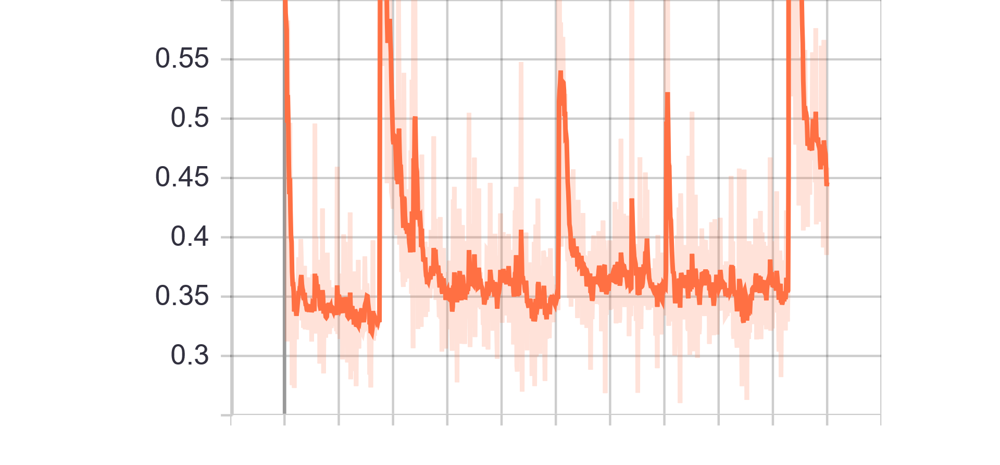
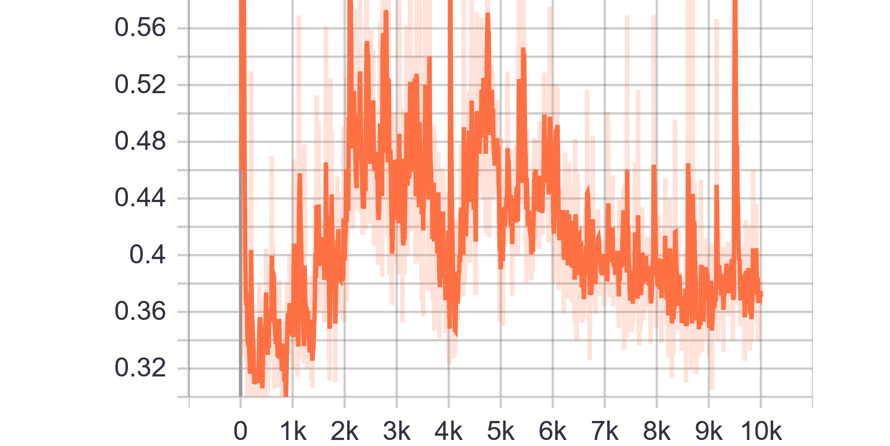

# HomoGAN

Training a GAN from scratch and improve it by experiments 

## Table of Contents

- [HomoGAN](#homogan)
  * [Table of Contents](#table-of-contents)
  * [Installation](#installation)
  * [Running experiments](#running-experiments)
  * [Dataset](#dataset)
  * [Glossary](#glossary)
  * [Experiments](#experiments)
    + [Experiment 1](#experiment-1)
    + [Experiment 2](#experiment-2)
    + [Experiment 3](#experiment-3)
    + [Experiment 4](#experiment-4)
    + [Experiment 5](#experiment-5)
    + [Experiment 6](#experiment-6)
    + [Experiment 7](#experiment-7)
    + [Experiment 8](#experiment-8)
    + [Experiment 9](#experiment-9)
    + [Experiment 10](#experiment-10)
    + [Experiment 11](#experiment-11)
    + [Experiment 12, 13, 14](#experiment-12-13-14)
    + [Experiment 15](#experiment-15)

## Installation
    $ git clone https://github.com/anieto95/homogan
    $ cd homogan/
    $ sudo pip3 install -r requirements.txt

## Running experiments

In order to train the model, parameters should be set in `config.json`. Once parameters are set, simply run `main.py`.
Nevertheless, older experiments can be run as well. They can be found in `docs/ExperimentXX`. Though parameters can't be changed, they can be tested by running `docs/ExperimentXX/main.py`.

## Dataset

CelebFaces Attributes Dataset (CelebA) is a large-scale face attributes dataset with more than 200K celebrity images, each with 40 attribute annotations. The images in this dataset cover large pose variations and background clutter.

For the whole project, images have been cropped and reduced to 128x128px. For the Experiment 16, images were preprocessed to delete the background.

## Glossary
* Generator (G)
* Discriminator (D)
* Fully Connected (FC)
* Fully Convolutional (FConv)

## Experiments
### Experiment 1
- Added normalization

### Experiment 2
- Normalization

### Experiment 3
- Normalization

### Experiment 4
Change from previous models: 
* The two FC input layers of the G changed to FConv.
* Update restriction on the D -> D is not updated while G loss is >4.

#### Results
Trainning size = 10.000\
Trainning Epochs = 20\
Batch Size = 16

__Observation__: 
|||
|:---:|:---:|
|Generator Loss|Discriminator Loss|
|||
|Fake accuracy|Real accuracy|

### Experiment 5
Change from previous models: 
* Removed restriction on D update

#### Results
Trainning size = 10.000\
Trainning Epochs = 20\
Batch Size = 16

__Observation__: 
|||
|:---:|:---:|
|Generator Loss|Discriminator Loss|
|||
|Fake accuracy|Real accuracy|

### Experiment 6
Change from previous models: 
* Added label smoothing (0 -> {0-0.1} and 1 -> {0.9-1})
* Added label flipping on 5% of labels

#### Results
Trainning size = 10.000\
Trainning Epochs = 20\
Batch Size = 16

__Observation__: 
|||
|:---:|:---:|
|Generator Loss|Discriminator Loss|
|||
|Fake accuracy|Real accuracy|

### Experiment 7
Change from previous models: 
* Change model architecture.
* Remove BatchNorm layers
* Remove Label Smoothing and Label flip

#### Results
Trainning size = 10.000\
Trainning Epochs = 100\
Batch Size = 100

__Observation__: 
|||
|:---:|:---:|
|Discriminator Loss Fake|Discriminator Loss Real|
||
|Generator Loss|

### Experiment 8
Change from previous models: 
* Only male images
* Added label smoothing (0 -> {0-0.1} and 1 -> {0.9-1})
* Added label flipping on 5% of labels

#### Results
Trainning size = 22.000\
Trainning Epochs = 100\
Batch Size = 200

__Observation__: 
|||
|:---:|:---:|
|Discriminator Loss Fake|Discriminator Loss Real|
||
|Generator Loss|

### Experiment 9
Change from previous models: 
* Using male and female images at 50%
* Introduced training ratio G:D, set to 1:3 (traing D 3 times more than G)

#### Results
Trainning size = 10.000\
Trainning Epochs = 100\
Batch Size = 100

__Observation__: 
|||
|:---:|:---:|
|Discriminator Loss Fake|Discriminator Loss Real|
||
|Generator Loss|

### Experiment 10
Change from previous models: 
* Chenge architecture to introduce conditioning GAN
* Only 1 feature allowed for conditioning 
* Ratio G:D, set to 1:1

#### Results
Trainning size = 10.000\
Trainning Epochs = 100\
Batch Size = 100

__Observation__: 
|||
|:---:|:---:|
|Discriminator Loss Fake|Discriminator Loss Real|
||
|Generator Loss|

### Experiment 11
Change from previous models: 
* Introduced training ratio G:D, set to 1:3 (traing D 3 times more than G)

#### Results
Trainning size = 10.000\
Trainning Epochs = 100\
Batch Size = 100

__Observation__: 
|||
|:---:|:---:|
|Discriminator Loss Fake|Discriminator Loss Real|
||
|Generator Loss|

### Experiment 12, 13, 14
Using Experiment 11 as base: 
* Introduced Spectral Normalization
* Training ratio G:D used:
    * 1:1
    * 1:3 
    * 1:5 

#### Results
* Trainning size = 10.000
* Trainning Epochs = 100\220\100
* Batch Size = 100

__Observation__: 

|Ratio 1:1|Ratio 1:3|Ratio 1:5|
|:---:|:---:|:---:|
||||
|Discriminator Loss Fake Exp 12|Discriminator Loss Fake Exp 13|Discriminator Loss Fake Exp 14|
||||
|Discriminator Loss Real Exp 12|Discriminator Loss Real Exp 13|Discriminator Loss Real Exp 14|
||||
|Generator Loss Exp 12|Generator Loss Exp 13|Generator Loss Exp 14|

### Experiment 15
Using Experiment 11 as base: 
* Implementation of Multi-labeling 
* Labels:
    * Bald
    * Glasses
    * Beard

#### Results
* Trainning size = 9000
* Trainning Epochs = 100
* Batch Size = 100

__Observation__: 
|||
|:---:|:---:|
|Discriminator Loss Fake|Discriminator Loss Real|
||
|Generator Loss|
